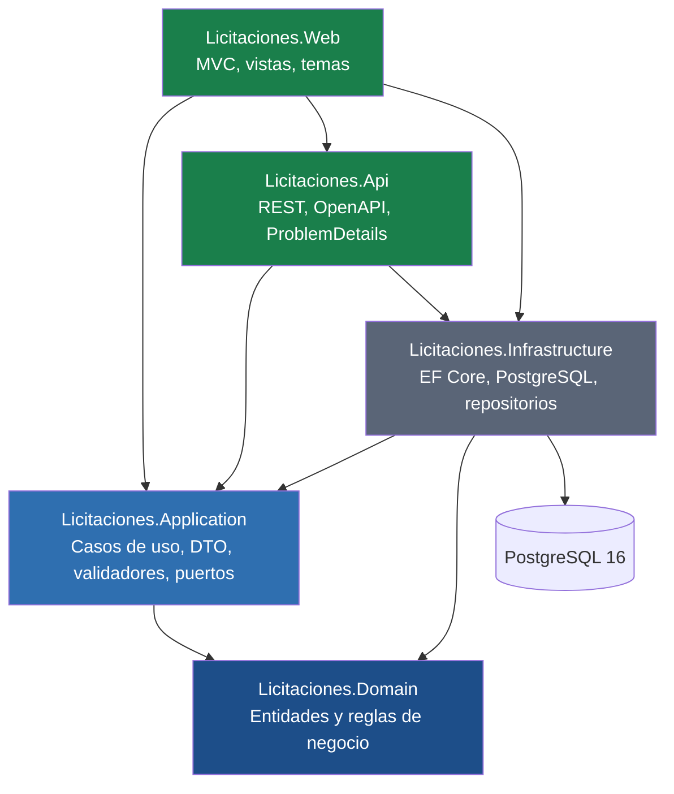
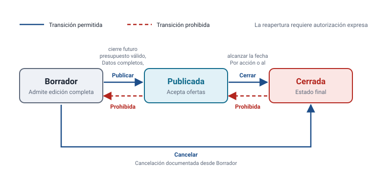
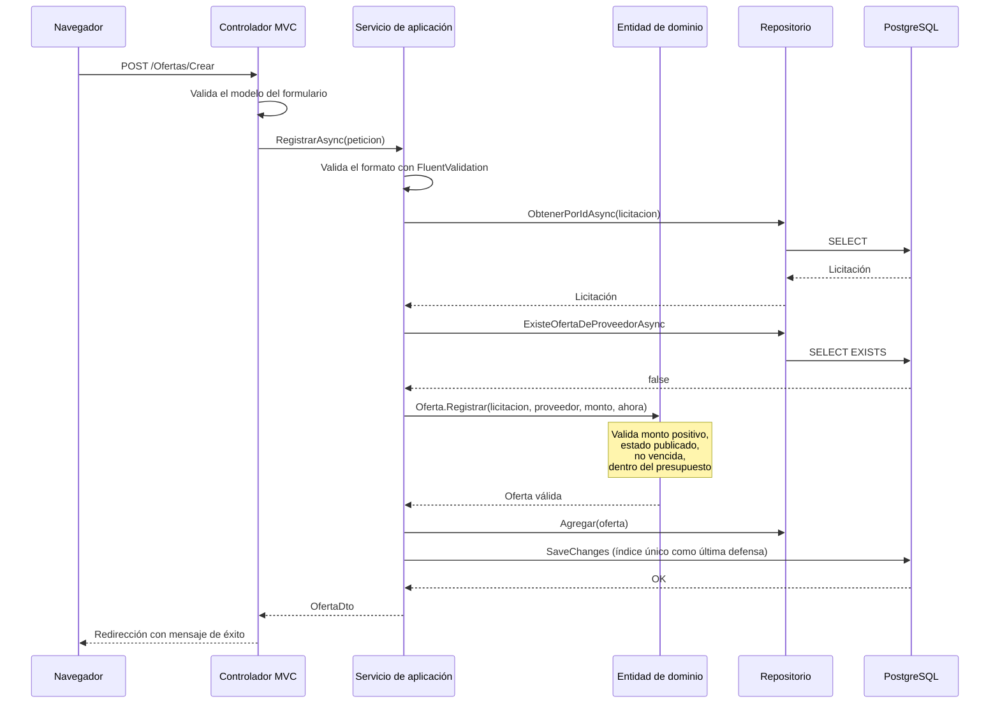
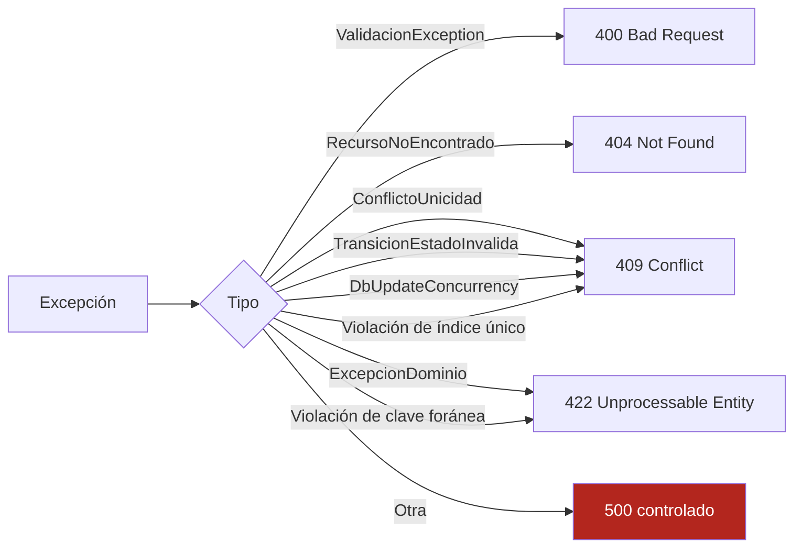

# Arquitectura general

## Forma de la solución

El sistema es un **monolito modular**. La sección 6.3 del enunciado admite monolito modular o
microservicios, y advierte que la elección no cambia la ponderación ni exime de ningún requisito.
Se eligió monolito modular por una razón concreta: **no existe ninguna necesidad que justifique
separar procesos.**

Dividir en microservicios tendría sentido si distintas partes necesitaran escalar por separado,
desplegarse a ritmos distintos o pertenecer a equipos diferentes. Nada de eso ocurre aquí: hay un
único desarrollador, un único ritmo de entrega y una carga uniforme. Separar el sistema en
servicios habría agregado comunicación por red, consistencia distribuida y despliegue coordinado
para resolver problemas que no existen. El propio enunciado lo previene: *«no se aceptará dividir
artificialmente el sistema para aparentar mayor complejidad»*.

La modularidad es real aunque el proceso sea uno solo: está en las fronteras entre proyectos, en
la dirección de las dependencias y en el hecho de que la capa de dominio no puede compilar contra
infraestructura aunque alguien lo intente.

## Capas



### Regla de dependencias

Las flechas apuntan siempre hacia el centro. `Licitaciones.Domain` no referencia ningún paquete de
acceso a datos ni de ASP.NET Core; esa restricción está anotada en su archivo de proyecto y es
verificable abriéndolo.

La inversión ocurre en `Licitaciones.Application`: define los puertos (`ILicitacionRepositorio`,
`IUnidadTrabajo`) e `Infrastructure` los implementa. Así la capa de aplicación depende de una
abstracción que ella misma controla, no de Entity Framework Core.

`IRelojSistema` sigue el mismo patrón y por el mismo motivo: el dominio necesita saber qué hora es
para decidir si una licitación venció, pero no debe depender del reloj del sistema operativo. Su
única implementación real vive en `Infrastructure`; las pruebas usan un reloj fijo.

## Responsabilidades

| Proyecto | Responsabilidad | Qué **no** hace |
|---|---|---|
| **Domain** | Entidades, enumeraciones, objetos de valor, reglas de negocio, excepciones tipadas | No sabe que existe una base de datos ni HTTP |
| **Application** | Casos de uso, DTO, validadores, puertos de repositorio, contexto de moneda | No sabe qué motor de datos hay detrás ni cómo se renderiza |
| **Infrastructure** | `DbContext`, configuraciones, repositorios, migraciones, unidad de trabajo, reloj real | No contiene reglas de negocio |
| **Api** | Endpoints REST, versionado, OpenAPI, traducción de excepciones a HTTP | No contiene reglas de negocio ni consultas |
| **Web** | Controladores MVC, vistas, temas, formato cultural | No contiene reglas de negocio ni consultas |

## Decisiones de arquitectura

### Un solo proceso aloja la interfaz y la API

El proyecto `Web` incorpora los controladores de `Api` mediante `AddApplicationPart`. Eso produce
un único contenedor que sirve la interfaz, los endpoints REST y la documentación interactiva.

**Alternativa descartada:** dos despliegues separados. Habría duplicado los manifiestos, las
sondas y la configuración para dos procesos que comparten la misma base de datos y el mismo ritmo
de entrega. El proyecto `Api` conserva su propio punto de entrada y puede ejecutarse por separado
si en algún momento se justificara.

### Las reglas viven en las entidades, no en los servicios

`Licitacion.Publicar`, `Oferta.Registrar` y `NivelAprobacion.Crear` validan sus propias
precondiciones. El servicio de aplicación coordina, pero no reimplementa.

**Por qué importa:** si la validación viviera en el servicio, cualquier camino que no pasara por
él —una prueba, un comando de mantenimiento, un endpoint nuevo— podría construir una entidad en
estado inválido. Con la regla en la factoría, ese estado es inalcanzable.

**Consecuencia asumida:** algunas reglas necesitan datos que la entidad no puede conocer, como si
un código ya existe o cuál es la oferta más alta. En esos casos el servicio consulta el repositorio
y **le pasa el dato** a la entidad, en lugar de decidir por ella. `Licitacion.ActualizarDatos`
recibe `mayorOfertaRegistradaCrc` justamente por eso.

### Validación en tres capas

La sección 8.3 del enunciado exige validar la unicidad en interfaz, servidor y PostgreSQL. Cada
capa cubre un hueco distinto:

| Capa | Qué aporta | Qué no puede cubrir |
|---|---|---|
| Interfaz | Respuesta inmediata sin ir al servidor | Cualquier cliente que no sea el navegador |
| Servidor | Mensaje claro y controlado, con el campo señalado | Dos peticiones simultáneas que la superen ambas |
| PostgreSQL | Garantía absoluta, incluso ante concurrencia o SQL manual | Un mensaje comprensible para el usuario |

Por eso el manejador global traduce la violación de índice único a un ProblemDetails con el mismo
código de error que habría producido la comprobación de aplicación: el cliente ve la misma
respuesta, gane la carrera quien la gane.

### Concurrencia optimista con `xmin`

Se usa la columna de sistema `xmin` de PostgreSQL como token de concurrencia. No ocupa espacio
adicional, el motor la actualiza sola en cada `UPDATE` y no requiere disciplina del código de
aplicación.

**Alternativa descartada:** una columna `version` propia incrementada manualmente. Habría que
acordarse de incrementarla en cada camino de escritura, y olvidarlo en uno solo desactivaría la
protección en silencio.

### El reloj es inyectable

Ninguna clase de dominio ni de aplicación invoca `DateTimeOffset.UtcNow`. Lo exige la sección 8.2
y resuelve un problema concreto: una prueba de vencimiento que dependa de la hora real es
intermitente, y una prueba intermitente se termina ignorando.

### Fechas en UTC, presentación en hora local

Todo se almacena y se compara en UTC. La conversión a `America/Costa_Rica` ocurre solo en
`FormateadorFecha`, dentro de la capa web.

**Detalle que causó un defecto real durante el desarrollo:** el control `datetime-local` del
navegador envía la fecha sin desplazamiento horario. Interpretarla como UTC desplazaba el cierre
seis horas. Por eso existe `DesdeControlCalendario`, que la interpreta explícitamente como hora de
Costa Rica antes de convertir.

### Recursos del front-end propios, sin CDN

El requisito 9 pide que la interfaz no quede inutilizable por falta de acceso a una CDN. En lugar
de incorporar un framework visual y copiarlo localmente, se escribieron una hoja de estilos y un
archivo de guiones propios. El resultado pesa unos pocos kilobytes y **no tiene ninguna
dependencia externa**.

El tema claro y oscuro se resuelve con variables CSS y un atributo `data-tema` que escribe el
servidor a partir de una cookie. Resolverlo en el servidor evita el parpadeo de la página
pintándose en claro antes de pasar a oscuro.

## Ciclo de estados

El ciclo de vida de una licitación, con sus transiciones permitidas y prohibidas, está detallado en
[`assets/ciclo-estados.svg`](assets/ciclo-estados.svg) y en
[`modulos/licitaciones.md`](modulos/licitaciones.md).



## Flujo de una petición



Si cualquier paso falla, la excepción llega al manejador global, que la traduce al código HTTP y al
ProblemDetails correspondientes sin exponer detalles internos.

## Manejo de errores



Toda respuesta de error incluye `codigoError` y `correlacion`. El código es estable y está definido
en `CodigosError`; la correlación permite ubicar el registro completo en el servidor sin exponerlo
al cliente.

## Rendimiento

Tres decisiones tomadas por medición del comportamiento, no por optimización especulativa:

1. **`ContextoMoneda` con ciclo de vida por petición.** Sin él, cada monto convertido consultaba
   el tipo de cambio activo: un listado de 20 licitaciones hacía 20 consultas idénticas.
2. **`ContarOfertasAsync` con una sola agregación.** El listado de proveedores cargaba la colección
   completa de ofertas de cada proveedor para mostrar un número.
3. **`AsSplitQuery` en las consultas con inclusión de colecciones.** Un `JOIN` habría duplicado las
   columnas de la licitación por cada oferta asociada.

## Estructura de carpetas

```
src/
  Licitaciones.Domain/
    Abstracciones/     IRelojSistema
    Constantes/        CodigosError
    Entidades/         Licitacion, Proveedor, Oferta, NivelAprobacion, TipoCambio
    Enums/             EstadoLicitacion, ClasificacionAhorro
    Excepciones/       Jerarquía de excepciones de dominio
    ObjetosValor/      ResultadoEvaluacionOfertas
    Servicios/         EvaluadorOfertas, SelectorNivelAprobacion, ConversorMoneda,
                       PoliticaTransicionEstado, NormalizadorTexto
  Licitaciones.Application/
    Abstracciones/     Puertos de repositorio y unidad de trabajo
    Comun/             PaginaResultado, ParametrosConsulta
    Dtos/              Contratos de entrada y salida
    Excepciones/       ValidacionException
    Servicios/         Servicios de aplicación por módulo
    Validadores/       Validadores de FluentValidation
  Licitaciones.Infrastructure/
    Migraciones/       Migración inicial y snapshot del modelo
    Persistencia/      DbContext, configuraciones, unidad de trabajo, iniciador
    Repositorios/      Implementaciones de los puertos
    Servicios/         RelojSistema
  Licitaciones.Api/
    Comun/             Manejador global de excepciones, parámetros de consulta
    Configuracion/     Configuración de OpenAPI
    Controladores/     Controladores REST
  Licitaciones.Web/
    Controladores/     Controladores MVC
    Modelos/           Modelos de vista y de formulario
    Servicios/         Preferencias, formateadores
    Views/             Vistas Razor
    wwwroot/           Hoja de estilos y guiones propios
```
