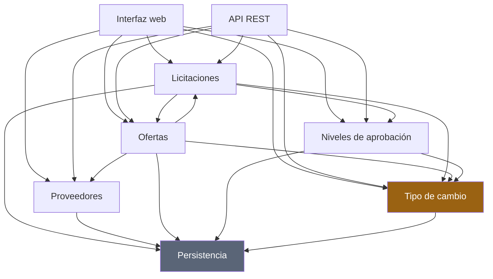
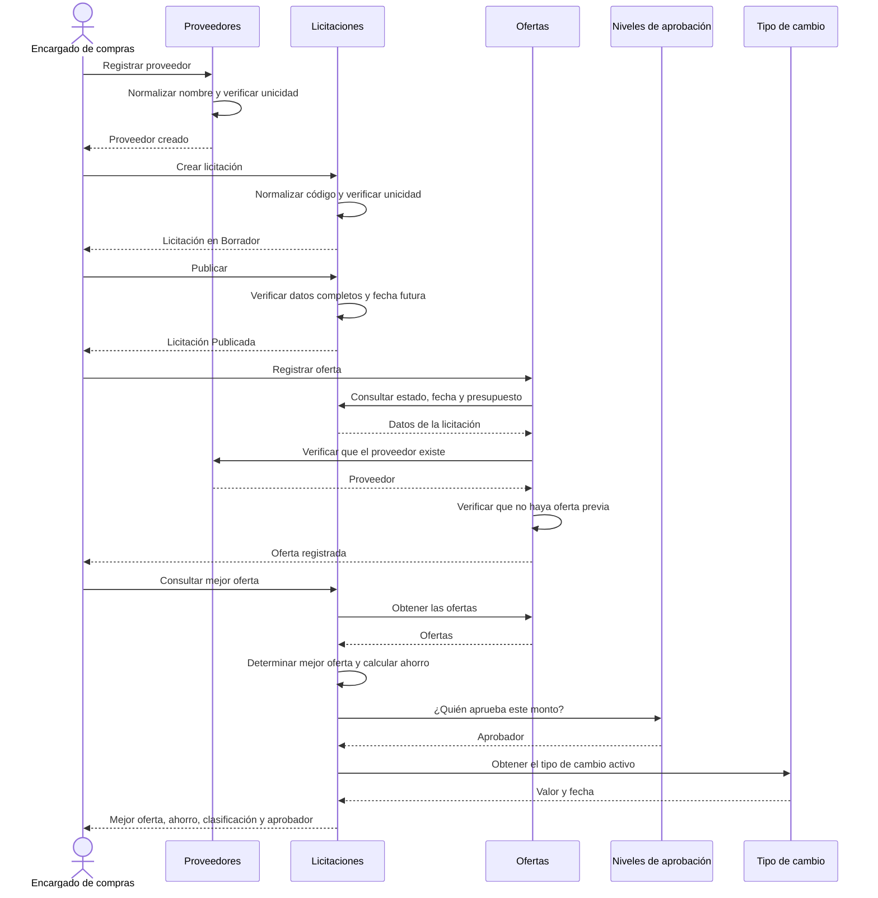
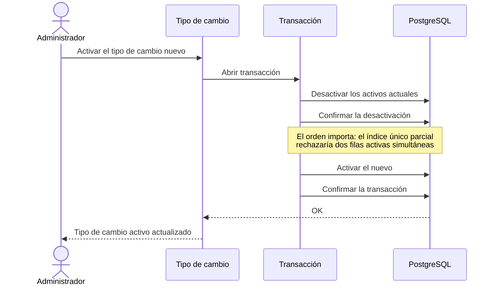
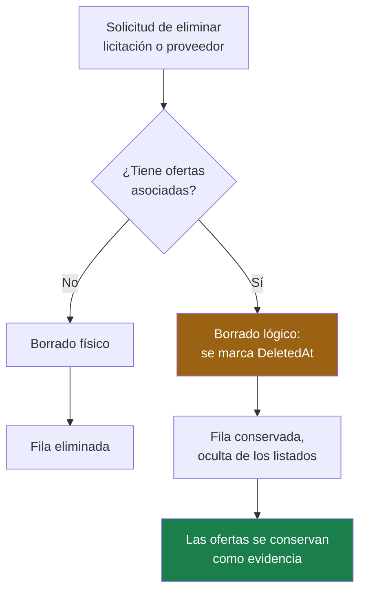

# Integración entre módulos

Este documento explica **cómo cooperan** los módulos: qué depende de qué, cómo viaja la información
entre ellos y dónde están los límites. Cada módulo tiene además su documento propio en
[`modulos/`](modulos/).

## Mapa de dependencias

### Naturaleza de cada dependencia

| Origen | Destino | Tipo | Qué necesita |
|---|---|---|---|
| Ofertas | Licitaciones | **Fuerte** | El estado, la fecha de cierre y el presupuesto para validar la oferta |
| Ofertas | Proveedores | **Fuerte** | La existencia del proveedor y su nombre |
| Licitaciones | Ofertas | **De lectura** | Las ofertas para evaluar la mejor y calcular el ahorro |
| Licitaciones | Niveles de aprobación | **De consulta** | El aprobador que corresponde al monto ganador |
| Todos | Tipo de cambio | **De presentación** | El valor para calcular el equivalente en dólares |

La dependencia con el tipo de cambio es la más débil de todas y merece destacarse: **su ausencia no
impide ninguna operación**. Sin tipo de cambio activo el sistema sigue funcionando por completo;
solo deja de mostrar el equivalente en dólares. Ninguna regla de negocio consulta esa conversión.

### La relación circular entre Licitaciones y Ofertas

Es aparente, no real. Se resuelve en direcciones distintas:

- **Ofertas → Licitaciones** ocurre en la **escritura**. `Oferta.Registrar` recibe la licitación
  completa y valida contra su estado, su fecha y su presupuesto.
- **Licitaciones → Ofertas** ocurre en la **lectura**. `LicitacionServicio` consulta las ofertas
  para evaluarlas, pero nunca las modifica.

Ninguna entidad modifica a la otra. La única excepción aparente —la regla que impide reducir el
presupuesto por debajo de una oferta existente— se resuelve pasando el dato a la entidad:
`Licitacion.ActualizarDatos` recibe `mayorOfertaRegistradaCrc` como parámetro, en lugar de consultar
el repositorio de ofertas.

---

## Flujos de extremo a extremo

### Flujo 1 — Del alta a la adjudicación

**Puntos de integración críticos**

1. **Ofertas necesita la licitación completa, no solo su identificador.** Validar el estado, el
   vencimiento y el presupuesto requiere los datos. Por eso el servicio la carga antes de invocar
   la factoría.
2. **La evaluación no persiste nada.** `ResultadoEvaluacionOfertas` se calcula a demanda. Si se
   almacenara, quedaría desincronizado en cuanto llegara una oferta nueva.
3. **El aprobador se consulta, no se guarda en la licitación.** Cambiar la tabla de rangos se
   refleja de inmediato en todas las consultas, sin actualizar filas históricas.

---

### Flujo 2 — Cambio del tipo de cambio

Ninguna licitación ni oferta se modifica. Los montos almacenados siguen siendo exactamente los
mismos; lo único que cambia es el valor con el que se calcula la representación en dólares en las
consultas posteriores.

---

### Flujo 3 — Eliminación con integridad referencial

La decisión se toma en el servicio de aplicación, que es quien puede consultar si existen registros
relacionados. La entidad solo expone la variante segura: `EliminarLogicamente`.

Como última defensa, las claves foráneas usan `ON DELETE RESTRICT`. Aunque alguien intentara el
borrado físico saltándose el servicio, PostgreSQL lo rechazaría.

---

## Contratos entre capas

### Interfaz web y API comparten los servicios de aplicación

Ambas fachadas consumen exactamente los mismos servicios. Esa reutilización es deliberada:
garantiza que una regla de negocio no pueda comportarse de una forma en la pantalla y de otra por
la API.

| Aspecto | Interfaz web | API REST |
|---|---|---|
| Entrada | Modelo de formulario con anotaciones de datos | DTO con validadores de FluentValidation |
| Servicio | **El mismo** | **El mismo** |
| Salida | Vista Razor | DTO serializado a JSON |
| Error | Mensaje junto al campo | ProblemDetails con código de error |

La diferencia está solo en los extremos: cómo entra el dato y cómo se presenta el resultado.

### La capa de aplicación no conoce Entity Framework Core

Depende de puertos que ella misma define. La implementación vive en `Infrastructure`. Eso permite
que las pruebas unitarias sustituyan los repositorios sin levantar una base de datos, y mantiene la
regla de dependencias apuntando hacia el dominio.

### El dominio no conoce nada externo

`Licitaciones.Domain` no referencia ningún paquete de acceso a datos ni de ASP.NET Core. Necesita
saber qué hora es, y lo resuelve con `IRelojSistema`, una abstracción propia.

---

## Puntos de acoplamiento y su justificación

| Acoplamiento | Por qué es aceptable |
|---|---|
| `Oferta.Registrar` recibe la entidad `Licitacion` completa | Necesita tres de sus datos para validar. Pasar solo el identificador obligaría a consultar desde el dominio, que es justamente lo que no debe hacer |
| `LicitacionDetalleDto` incluye las ofertas y la evaluación | La pantalla de detalle las necesita todas a la vez. Separarlas obligaría al cliente a hacer tres peticiones para mostrar una pantalla |
| `ContextoMoneda` lo consumen cuatro servicios | Es un servicio de presentación, sin reglas de negocio. Su alternativa era repetir la consulta del tipo de cambio en cada uno |
| El proyecto `Web` referencia `Api` | Es lo que permite alojar la interfaz y los endpoints en un solo proceso. La alternativa era duplicar los controladores |

---

## Trazabilidad de los requisitos

Correspondencia entre cada requisito del enunciado, el módulo que lo implementa y la prueba que lo
verifica. Es la cadena que pide el criterio de trazabilidad de la rúbrica.

| Requisito | Módulo | Prueba principal |
|---|---|---|
| 8.1 Ciclo de estados | Licitaciones | `PoliticaTransicionEstadoPruebas` |
| 8.1 Cierre funcional por vencimiento | Licitaciones | `LicitacionPruebas.EstaCerradaFuncionalmente_*` |
| 8.2 Rechazo de oferta vencida | Ofertas | `OfertaPruebas.Registrar_EnElInstanteExactoDelCierre_Falla` |
| 8.2 Fechas en UTC, presentación local | Interfaz web | `ConcurrenciaYTransaccionPruebas.Fechas_SeConservanEnUtc*` |
| 8.2 Reloj inyectable | Dominio | `RelojFijo` en todas las pruebas de vencimiento |
| 8.3 Unicidad de código | Licitaciones | `RestriccionesPruebas.IndiceUnico_RechazaDosLicitaciones*` |
| 8.3 Unicidad de proveedor | Proveedores | `ProveedorPruebas.Crear_NormalizaLosNombresEquivalentes*` |
| 8.3 Oferta única por proveedor | Ofertas | `RestriccionesPruebas.IndiceUnicoCompuesto_*` |
| 8.4 Caracteres permitidos | Proveedores | `ProveedorPruebas.Crear_RechazaLosCaracteresNoPermitidos` |
| 8.5 Montos positivos | Todos | `ck_*_positivo` y pruebas de cada entidad |
| 8.5 Oferta acotada por presupuesto | Ofertas | `OfertaPruebas.Registrar_ConMontoIgualAlPresupuesto_EsValida` |
| 8.5 Presupuesto no reducible | Licitaciones | `LicitacionPruebas.ActualizarDatos_ReduciendoElPresupuesto*` |
| 8.6 Mejor oferta y desempate | Licitaciones | `EvaluadorOfertasPruebas.Evaluar_ConEmpateDeMonto_*` |
| 8.6 Clasificación del ahorro | Licitaciones | `EvaluadorOfertasPruebas.Evaluar_ClasificaSegunElAhorro` |
| 8.7 Aprobador parametrizable | Niveles de aprobación | `SelectorNivelAprobacionPruebas.Seleccionar_*` |
| 8.7 Rangos sin traslape | Niveles de aprobación | `SelectorNivelAprobacionPruebas.AsegurarConjuntoValido_*` |
| 8.8 Conversión CRC/USD | Tipo de cambio | `ConversorMonedaPruebas.*` |
| 8.8 Un solo tipo de cambio activo | Tipo de cambio | `RestriccionesPruebas.IndiceUnicoParcial_*` |
| 8.9 Integridad al eliminar | Persistencia | `RestriccionesPruebas.ClaveForanea_*` |
| 8.9 Confirmación antes de eliminar | Interfaz web | `FlujoCompletoPruebas.Eliminar_PideConfirmacion*` |
| 9 Modo claro y oscuro | Interfaz web | `InterfazPruebas.ModoOscuro_*` |
| 9 Alternancia de moneda | Interfaz web | `InterfazPruebas.AlternarMoneda_*` |
| 9 Diseño adaptable | Interfaz web | `InterfazPruebas.DisenoAdaptable_*` |
| 10 ProblemDetails seguro | API REST | `LicitacionesEndpointsPruebas.ProblemDetails_NoExponeDetallesInternos` |
| 10 Paginación | API REST | `LicitacionesEndpointsPruebas.Get_Listado_*` |
| 11 Concurrencia optimista | Persistencia | `ConcurrenciaYTransaccionPruebas.ConcurrenciaOptimista_*` |
| 11 Transacciones | Persistencia | `ConcurrenciaYTransaccionPruebas.Transaccion_*` |
| 11 Migraciones y semilla | Persistencia | `EsquemaYSemillaPruebas.*` |
| 5.3 Flujo funcional mínimo | Todos | `FlujoCompletoPruebas.FlujoMinimo_*` |
