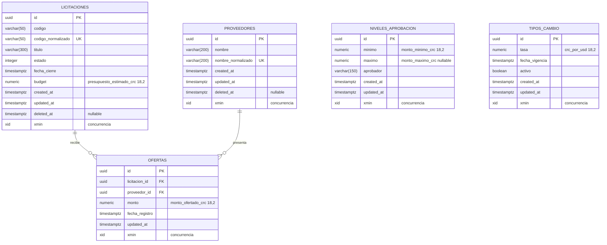

# Modelo de datos

## Diagrama entidad-relación

`niveles_aprobacion` y `tipos_cambio` no tienen relación física con las demás tablas. Son tablas de
parametrización: la relación con una oferta es de cálculo, no de clave foránea. Se resuelve
comparando el monto contra los rangos en el momento de la consulta, de modo que un cambio en la
tabla se refleja de inmediato sin tener que actualizar filas históricas.

---

## Tablas

### `licitaciones`

| Columna | Tipo | Nulo | Descripción |
|---|---|---|---|
| `id` | `uuid` | No | Identificador generado por el sistema, no editable |
| `codigo` | `varchar(50)` | No | Código visible, tal como lo escribió el usuario |
| `codigo_normalizado` | `varchar(50)` | No | Forma normalizada usada por el índice único |
| `titulo` | `varchar(300)` | No | Título descriptivo |
| `estado` | `integer` | No | 0 Borrador, 1 Publicada, 2 Cerrada |
| `fecha_cierre` | `timestamptz` | No | Fecha y hora límite, en UTC |
| `presupuesto_estimado_crc` | `numeric(18,2)` | No | Presupuesto en colones |
| `created_at` | `timestamptz` | No | Instante de creación |
| `updated_at` | `timestamptz` | No | Instante de última modificación |
| `deleted_at` | `timestamptz` | Sí | Marca de borrado lógico |
| `xmin` | `xid` | No | Columna de sistema usada como token de concurrencia |

**Restricciones**

- `pk_licitaciones` — clave primaria sobre `id`
- `ck_licitaciones_presupuesto_positivo` — `presupuesto_estimado_crc > 0`
- `ck_licitaciones_estado_valido` — `estado IN (0, 1, 2)`

**Índices**

- `ux_licitaciones_codigo_normalizado` — único, sobre `codigo_normalizado`
- `ix_licitaciones_estado` — filtro por estado en los listados
- `ix_licitaciones_fecha_cierre` — consultas por vencimiento

---

### `proveedores`

| Columna | Tipo | Nulo | Descripción |
|---|---|---|---|
| `id` | `uuid` | No | Identificador generado por el sistema |
| `nombre` | `varchar(200)` | No | Nombre visible, limpio de espacios sobrantes |
| `nombre_normalizado` | `varchar(200)` | No | Forma normalizada usada por el índice único |
| `created_at` | `timestamptz` | No | Instante de creación |
| `updated_at` | `timestamptz` | No | Instante de última modificación |
| `deleted_at` | `timestamptz` | Sí | Marca de borrado lógico |
| `xmin` | `xid` | No | Token de concurrencia |

**Índices**

- `ux_proveedores_nombre_normalizado` — único, sobre `nombre_normalizado`

---

### `ofertas`

| Columna | Tipo | Nulo | Descripción |
|---|---|---|---|
| `id` | `uuid` | No | Identificador generado por el sistema |
| `licitacion_id` | `uuid` | No | Clave foránea a `licitaciones` |
| `proveedor_id` | `uuid` | No | Clave foránea a `proveedores` |
| `monto_ofertado_crc` | `numeric(18,2)` | No | Monto en colones |
| `fecha_registro` | `timestamptz` | No | Instante de registro; define el desempate |
| `updated_at` | `timestamptz` | No | Instante de última modificación |
| `xmin` | `xid` | No | Token de concurrencia |

**Restricciones**

- `pk_ofertas` — clave primaria sobre `id`
- `ck_ofertas_monto_positivo` — `monto_ofertado_crc > 0`
- `fk_ofertas_licitaciones_licitacion_id` — `ON DELETE RESTRICT`
- `fk_ofertas_proveedores_proveedor_id` — `ON DELETE RESTRICT`

**Índices**

- `ux_ofertas_licitacion_proveedor` — único compuesto sobre `(licitacion_id, proveedor_id)`
- `ix_ofertas_licitacion_monto` — sobre `(licitacion_id, monto_ofertado_crc)`, para la mejor oferta
- `ix_ofertas_proveedor` — sobre `proveedor_id`

`ofertas` **no tiene `deleted_at`**. Es deliberado: la sección 8.9 exige conservar las ofertas
cerradas como evidencia y prohíbe alterarlas. Un borrado lógico sería precisamente una alteración.

---

### `niveles_aprobacion`

| Columna | Tipo | Nulo | Descripción |
|---|---|---|---|
| `id` | `uuid` | No | Identificador generado por el sistema |
| `monto_minimo_crc` | `numeric(18,2)` | No | Límite inferior inclusivo |
| `monto_maximo_crc` | `numeric(18,2)` | Sí | Límite superior inclusivo; nulo indica rango abierto |
| `aprobador` | `varchar(150)` | No | Cargo o instancia responsable |
| `created_at` | `timestamptz` | No | Instante de creación |
| `updated_at` | `timestamptz` | No | Instante de última modificación |
| `xmin` | `xid` | No | Token de concurrencia |

**Restricciones**

- `ck_niveles_aprobacion_minimo_positivo` — `monto_minimo_crc > 0`
- `ck_niveles_aprobacion_maximo_positivo` — `monto_maximo_crc IS NULL OR monto_maximo_crc > 0`
- `ck_niveles_aprobacion_rango_coherente` — `monto_maximo_crc IS NULL OR monto_maximo_crc >= monto_minimo_crc`

**Índices**

- `ux_niveles_aprobacion_monto_minimo` — único, impide dos rangos con el mismo punto de partida

El **no traslape entre rangos distintos** no puede expresarse con una restricción `CHECK` de fila,
porque requiere ver todas las filas. Se valida en la capa de aplicación sobre el conjunto completo
que quedaría vigente después de la operación.

---

### `tipos_cambio`

| Columna | Tipo | Nulo | Descripción |
|---|---|---|---|
| `id` | `uuid` | No | Identificador generado por el sistema |
| `crc_por_usd` | `numeric(18,2)` | No | Colones que equivalen a un dólar |
| `fecha_vigencia` | `timestamptz` | No | Fecha desde la que rige |
| `activo` | `boolean` | No | Indica si es el tipo de cambio en uso |
| `created_at` | `timestamptz` | No | Instante de creación |
| `updated_at` | `timestamptz` | No | Instante de última modificación |
| `xmin` | `xid` | No | Token de concurrencia |

**Restricciones**

- `ck_tipos_cambio_valor_positivo` — `crc_por_usd > 0`

**Índices**

- `ux_tipos_cambio_unico_activo` — **único parcial**, con filtro `WHERE activo`
- `ix_tipos_cambio_fecha_vigencia` — orden cronológico

El índice único parcial es la pieza que sostiene la invariante «un solo tipo de cambio activo».
PostgreSQL solo lo aplica a las filas donde `activo` es verdadero, de modo que puede haber tantos
registros históricos inactivos como se quiera, pero jamás dos activos a la vez.

---

## Decisiones de modelado

### Identificadores UUID versión 7

Los identificadores se generan con `Guid.CreateVersion7()`. La versión 7 incorpora una marca de
tiempo en los bits altos, de modo que los valores generados son **ordenables cronológicamente**.

**Por qué importa:** un UUID versión 4 es aleatorio, y usarlo como clave primaria en un índice B-tree
produce inserciones dispersas por todo el árbol, con fragmentación y páginas parcialmente llenas.
Con la versión 7 las inserciones son casi secuenciales.

**Efecto secundario aprovechado:** el orden del identificador sirve como tercer criterio de
desempate determinista en `EvaluadorOfertas`, después del monto y de la fecha de registro.

### `numeric(18,2)` y nunca punto flotante

Todos los montos usan `numeric(18,2)`. La sección 7 lo exige y la razón es concreta: los tipos de
punto flotante no representan exactamente los valores decimales. Un presupuesto de 1 234 567,89
almacenado como `double precision` puede volver como 1 234 567,8899999999, y una comparación de
igualdad contra el presupuesto fallaría de forma impredecible.

La prueba `Montos_ConservanLaPrecisionDecimalAlPersistirYRecuperar` verifica exactamente esto.

### Columna normalizada aparte del valor visible

Se guardan dos columnas: `nombre` con lo que escribió el usuario y `nombre_normalizado` para
comparar.

**Alternativa descartada:** un índice único sobre una expresión, como `UPPER(TRIM(nombre))`. Es
posible en PostgreSQL, pero la lógica de normalización quedaría duplicada en la base de datos y en
el código de aplicación, con el riesgo de que las dos versiones se separen con el tiempo. Con la
columna materializada, la normalización se calcula en un solo lugar del código y la base solo
indexa el resultado.

### `xmin` como token de concurrencia

`xmin` es una columna de sistema que PostgreSQL mantiene en toda tabla y actualiza en cada `UPDATE`.
Usarla como token de concurrencia no cuesta espacio ni disciplina de código.

**Consecuencia en las migraciones:** la columna no se crea en el DDL, porque ya existe. El modelo la
mapea con `ValueGeneratedOnAddOrUpdate`, de modo que Entity Framework Core la lee pero nunca intenta
escribirla.

### Borrado lógico solo donde aporta

| Tabla | Borrado lógico | Motivo |
|---|---|---|
| `licitaciones` | Sí | Puede tener ofertas que deben conservarse |
| `proveedores` | Sí | Puede tener ofertas históricas asociadas |
| `ofertas` | No | Son la evidencia; no deben alterarse |
| `niveles_aprobacion` | No | Parametrización; se reemplaza, no se archiva |
| `tipos_cambio` | No | El histórico se conserva marcando `activo = false` |

La capa de aplicación decide entre borrado físico y lógico según existan registros relacionados: si
no hay ofertas asociadas, el borrado físico es seguro y mantiene la tabla limpia.

---

## Migraciones

| Migración | Contenido |
|---|---|
| `20260818120000_InicialEsquemaLicitaciones` | Esquema completo, restricciones, índices y datos semilla |

Las migraciones se aplican automáticamente al arrancar, con reintentos mientras PostgreSQL termina
de aceptar conexiones. Eso es lo que permite que `docker compose up --build` funcione sin pasos
manuales intermedios.

### Datos semilla

**Niveles de aprobación** — reproducen exactamente la tabla de la sección 8.7:

| Monto mínimo | Monto máximo | Aprobador |
|---|---|---|
| 0,01 | 999 999,99 | Encargado de área |
| 1 000 000,00 | 9 999 999,99 | Gerencia |
| 10 000 000,00 | Sin límite | Junta Directiva |

**Tipo de cambio inicial:** 505,00 CRC por USD, activo. Permite que la conversión funcione desde el
primer arranque, sin Internet y sin configuración manual previa.

Los identificadores de la semilla son fijos, de modo que la carga es idempotente entre entornos y
las pruebas pueden referenciarlos.

---

## Consultas frecuentes y su respaldo

| Consulta | Índice que la respalda |
|---|---|
| Licitación por código normalizado | `ux_licitaciones_codigo_normalizado` |
| Listado filtrado por estado | `ix_licitaciones_estado` |
| Mejor oferta de una licitación | `ix_ofertas_licitacion_monto` |
| Ofertas de un proveedor | `ix_ofertas_proveedor` |
| Comprobación de oferta duplicada | `ux_ofertas_licitacion_proveedor` |
| Tipo de cambio activo | `ux_tipos_cambio_unico_activo` |
| Proveedor por nombre normalizado | `ux_proveedores_nombre_normalizado` |
